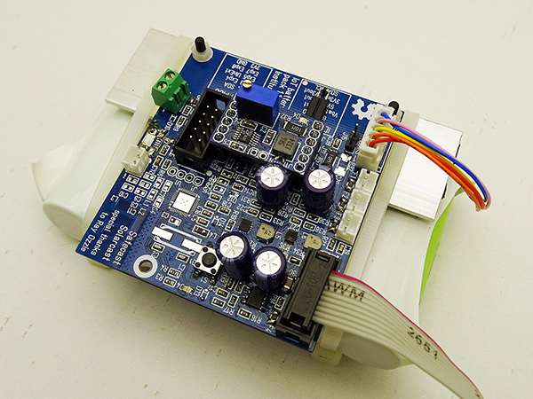
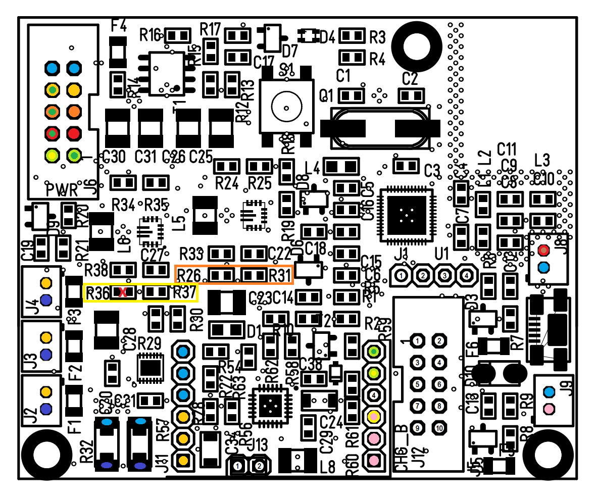

### IoT power module description

This repository contains the design parameters and implementation details of the IoT battery pack originally developed for [Safecst Solarcast](https://github.com/IRNAS/Solarcast) sensor device.

## GENERAL DESCRIPTION

IoT power module is powered from single lithium-ion cells (2/4/6 cells in parallel) and provides 3V3 and 5V stabilized output as well as battery output. All inputs can be turned off to avoid power consumption, however by default 3V3 output is always active (see later). Both switcher chips are buck-boost topology and operate with very low current when idle (< 100 uA)

The module itself is equipped with switcher battery charger, where charging current can be externally programmed using resistors (R56, R58) or programming through I2C interface is also possible. An add-on module enables charging from external solar panel or other input, where integrated electronics adjusts the current in a way, that current is lowered when Uin_min threshold is achieved (currently at 4V5). Other option is charging through microUSB port with 5 VDC.

The module can be equipped with Nordic nRF51822 microprocessor (M0 with BLE), that can be used to monitor and control charging process. Additionally, fuel gauge MAX17201 chip is integrated, which can monitor all battery parameters such as voltage, current, temperature, calculates state-of-charge (SOC), state-of-health (SOH) and many other parameters.

## BASIC BOARD OVERVIEW

### J2, J3, J4 (bottom left): Battery connectors, 3 pcs (JST 2-pole)
Connect to lithium battery pack. 3 packs can be connected simoultanously. Each branch is protected using 5A SMD fuse.
IMPORTANT!
 1. Always connect only battery packs with similar voltage/charging state. Connecting i.e. empty and full battery pack will drain huge current from full battery and burn fuse as well as damage to the batteries can be done!
 1. GND of the cells and GND of the system is not the same as there is a shunt resistor (R32, R57) in line between Cell_gnd and System_gnd.

### J6 (top left): PWR connector (IDC10):

1. - I2C SCL (3V3)
2. - I2C SDA (3V3)
3. - 5V0 output*
4. - 5V0_enable pin*
5. - 3V3 output (always on by default**)
6. - 3V3_enable pin (not used by default**)
7. - Vbat output (same logic as 5V0 output*)
8. - Vbat_enable pin
9. - GND
10. - GND

*By default, 5V0 output is disabled and can only be enabled if pulling 5V0 enable pin high. In case, that constant voltage is required on the 5V0 output, R36 must be populated. This will create resistor divider to define voltage level, when power will disable due to under-voltage condition.*

*By default, 3V3 output is always active and is disabled only, when under-voltage condition occurs (set to approx. 3V using R26 and R31). If you want to enable 3V3_enable control, R26 must be removed.*

### J8 + micro USB (middle right): +5 VDC power supply
Input for stabilized 5V power supply. Circuit around T2 serves adjusting charging current in a way, that if +5V power line drops, charging current is gradually reduced from approx. 1,8 A to 0,5 A at approx. 4,5 V.

### J9 (bottom right): external charging voltage (JST 2-pole)

Input for solar panel or other power source (voltage depends on a module installed).

### J11, J12 (bottom middle): connectors for add-on charging board

Module has prepared option to install add-on module with additional charger; this way i.e. MPPT module or wide-range DCDC charger can be installed and replaced if required. There are also I2C pins present at J12 as well as one additional pin from MCU as well as Usense pin, which regulates charging current for the on-board charging chip.

### J13 (bottom middle): connector for battery NTC thermistor (10k)

NTC thermistor must be thermally attached to the battery cell.

# IoT battery pack requirements
IoT battery pack is designed to provide power in various sensing applications, being able to deliver sufficient power for a wide range of sensors for short periods of time and have a long standby operation time between them. BLE interface allows users to configure it as well as provide a communication channel to talk to other sensors in the vicinity.

 * Capacity: 1P-6P Li-Po 18650 (3600mAh - 20000mAh)
  * Batteries connected in 3 branches of two, each branch fuse protected
  * User can connect 1-6 cells in parallel. For safety, no more then two can be directly connected in parallel, thus the 6 cells in parallel are split in 3 pairs of 2 cells in parallel, the sets connected together each via its own fuse.
  * Connector for cells: 2.54 JST (not mounted)
 * Input: 2A at 5V, input range 3-6V
  * DC jack input for solar cell, no diode used
  * Micro USB input for wall-socket (Additionally 2 pads for connections)
  * USB input must disconnect the solar cell and prevent discharge into it, can be done with a relay. Relay powered from USB socket via diode in a way, that NC is solar cell and NO is external 5 V input.
  * Current shall be adjustable from MCU (PWM?) and via trimmer in a way, that voltage is defined, where current is lowered (i.e. at 4V5 system goes to CV mode on input). Dynamic adjustment of charge current, such that the input voltage does not drop below 4.5V or other configurable level if possible. This prevents overloading of the supply, for example when solar cell is connected holds it reasonably close to maximum power output voltage. If possible the voltage level should be software controlled via BLE.

 * Output: 2A at 5V, 1A at 3.3V, direct battery voltage output
  * 5V - High-side switch or DC-DC module disable + fuse
  * 3.3V - High-side switch or DC-DC module disable + fuse
  * battery voltage - High-side switch and a fuse
  * Out connectors 2.54mm header/JST terminal
 * BLE processor (preferred Nordic nRF51822) on board implementing the following features in software:
  * battery voltage and current measurement. All voltages (inputs, outputs), current is measured through Fuel gauge chip via I2C
  * configurable thermal protection/shutdown via fuel gauge I2C
  * configurable battery charge voltage (over-voltage protection) via fuel gauge I2C
  * configurable battery discharge voltage (under-voltage protection) via fuel gauge I2C
  * I2C interface (nRF51822 SDA 10, SCL 8)
  * Enable/disable outputs as defined above
  * Expose remaining GPIO, about 8-10 are sufficient (to 10 pin header vcc/+3v3+8gpios)
  * RG(B) LED from MCU, software controlled and can be disabled fully
  * Standard Cortex programming connector
  * [Grove I2C connector](http://wiki.seeed.cc/Grove-I2C_Hub/)
 * Simultaneous charging and discharging
 * Low quiescent current - standby mode with 3.3V branch active no more then 100uA battery discharge current
 * Input DC-DC with current limiter
  * Dynamic adjustment of charge current, such that the input voltage does not drop below 4.5V or other configurable level if possible. This prevents overloading of the supply, for example when solar cell is connected holds it reasonably close to maximum power output voltage. If possible the voltage level should be software controlled via BLE.

 * Target production cost ~15EUR@1k
  * Batteries excluded
 * Prototyping process: 10 units for testing in first batch, 30 units in second batch

## Diagram
Diagram is made in http://draw.io

---

#### License

All our projects are as usefully open-source as possible.

Hardware including documentation is licensed under [CERN OHL v.1.2. license](http://www.ohwr.org/licenses/cern-ohl/v1.2)

Firmware and software originating from the project is licensed under [GNU GENERAL PUBLIC LICENSE v3](http://www.gnu.org/licenses/gpl-3.0.en.html).

Open data generated by our projects is licensed under [CC0](https://creativecommons.org/publicdomain/zero/1.0/legalcode).

All our websites and additional documentation are licensed under [Creative Commons Attribution-ShareAlike 4 .0 Unported License] (https://creativecommons.org/licenses/by-sa/4.0/legalcode).

What this means is that you can use hardware, firmware, software and documentation without paying a royalty and knowing that you'll be able to use your version forever. You are also free to make changes but if you share these changes then you have to do so on the same conditions that you enjoy.

Koruza, GoodEnoughCNC and IRNAS are all names and marks of Institut IRNAS Rače. 
You may use these names and terms only to attribute the appropriate entity as required by the Open Licences referred to above. You may not use them in any other way and in particular you may not use them to imply endorsement or authorization of any hardware that you design, make or sell.
