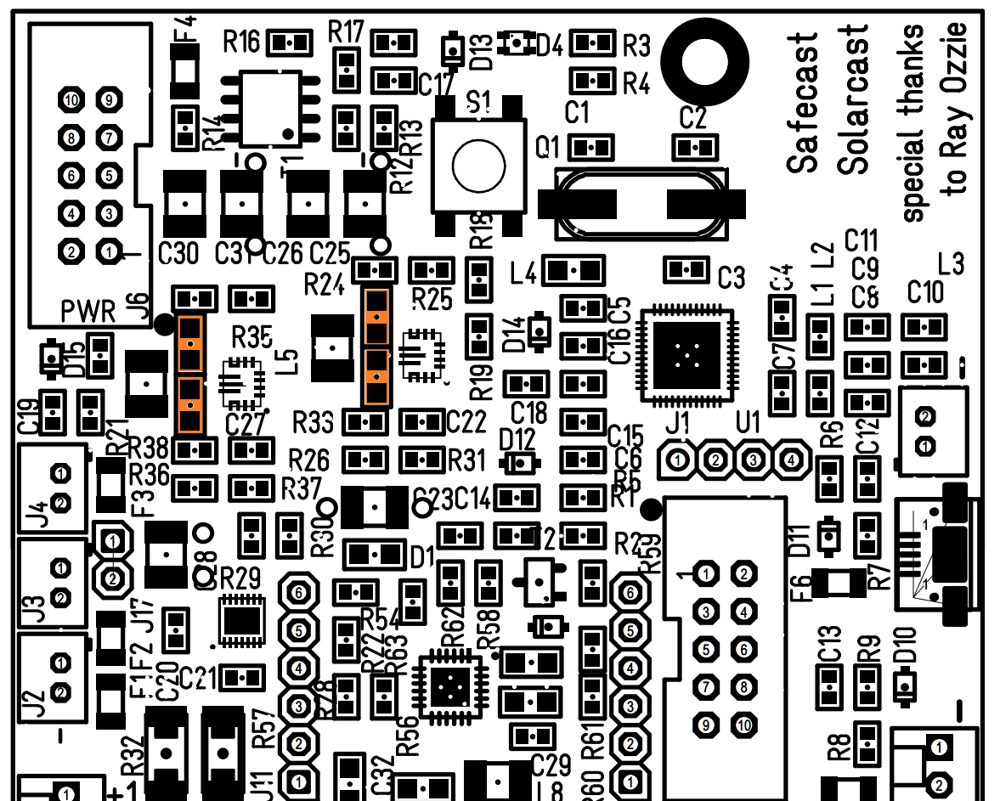

# IoT battery pack hardware
Last revision is v.1.2 available in this repository, while v.1.1 version can with manual fixes be brought to v.1.2.

## IoT power supply errata HW REV affected: v.1.1

- Missing 10 uF 10V X7R 0805 capacitors at input and output of IC1 and IC2 (fixed at v.1.2)
- Check/enlarge track for VBAT to BAT FET, optimize vias (too much current drop) (fixed at v.1.2)
- Modify resistor divider on MPPT charger to set charging voltage to 4,10 V (4,0 at v.1.1)

## Fuses
 * F1 - Battery fuse 3A
 * F2 - Battery fuse 3A
 * F3 - Battery fuse 3A
 * F4 - Battery output fuse 3A
 * F5 - Solar input fuse 3A
 * F6 - USB input fuse 3A
